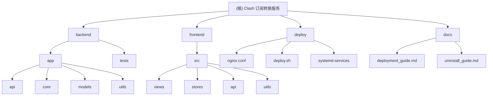

# 变更记录 (Changelog)

## [2025-01-22] - 架构分析完成

### 本次架构分析内容
- **目标**：对 Clash 订阅转换服务项目进行全面的架构分析和问题检查
- **范围**：后端 Python FastAPI、前端 Vue.js、Docker 部署、安全性评估
- **完成度**：已深度扫描后端核心业务逻辑、前端组件架构、配置文件和部署设置

### 识别的模块结构
- **后端核心**：`backend/app/` (FastAPI 架构，包含 API、核心业务、数据模型)
- **前端界面**：`frontend/src/` (Vue.js 3 + TypeScript + Element Plus)
- **部署配置**：`deploy/` (Docker、Nginx、SystemD 服务)
- **文档系统**：`docs/` (部署指南、卸载指南、生产部署)

### 核心架构问题识别
本次分析发现了涉及**安全性**、**性能**、**可维护性**和**稳定性**的多个关键问题，详细分析报告已在主对话中提供。

---

# 项目愿景

基于 FastAPI + Vue.js 的高性能 Clash 代理订阅转换服务，支持多种代理协议转换和自定义规则配置。

## 目标特性
- 🚀 **多协议支持**: SS、SSR、V2Ray、Trojan、Hysteria、TUIC、WireGuard 等
- 🔧 **灵活配置**: 支持远程配置规则（ACL4SSR、Subconverter 规则）
- 🎯 **节点管理**: 节点过滤、重命名、排序、国旗 Emoji 自动添加
- 📱 **现代化界面**: Vue.js 3 + TypeScript + Element Plus 响应式设计
- 🐳 **容器化部署**: Docker + Docker Compose，支持用户自定义端口

# 架构总览

## 技术栈
- **后端**: Python 3.9+ + FastAPI + Pydantic + HTTPX
- **前端**: Vue.js 3 + TypeScript + Element Plus + Pinia + Vite
- **部署**: Docker + Docker Compose + Nginx
- **数据格式**: YAML/JSON 配置文件，内存缓存

## 核心架构模式
- **后端**: RESTful API + 分层架构 (API -> Core -> Models)
- **前端**: 组件化架构 + 状态管理 (Pinia)
- **部署**: 微服务容器化 + 反向代理

# 模块结构图



# 模块索引

| 模块路径 | 职责描述 | 技术栈 | 入口文件 |
|---------|----------|--------|----------|
| `backend/` | FastAPI 后端服务，提供订阅转换 API | Python FastAPI | `app/main.py` |
| `frontend/` | Vue.js 前端界面，用户交互和配置管理 | Vue.js 3 + TypeScript | `src/main.ts` |
| `deploy/` | 部署配置和脚本，支持 Docker 和系统服务 | Shell + Docker + Nginx | `deploy.sh` |
| `docs/` | 项目文档，包括部署和使用指南 | Markdown | `deployment_guide.md` |
| `backend/app/api/` | API 路由定义和请求处理 | FastAPI Router | `converter.py` |
| `backend/app/core/` | 核心业务逻辑，订阅解析和转换 | Python | `converter.py` |
| `backend/app/models/` | 数据模型定义，Pydantic Schema | Pydantic | `schemas.py` |
| `frontend/src/views/` | Vue.js 页面组件 | Vue.js SFC | `Converter.vue` |
| `frontend/src/stores/` | Pinia 状态管理 | Pinia | `converter.ts` |

# 运行与开发

## 快速启动

### Docker 部署 (推荐)
```bash
# 克隆项目
git clone <repository-url>
cd subt

# 使用一键部署脚本
chmod +x deploy/deploy.sh
./deploy/deploy.sh

# 或者手动 Docker Compose
docker-compose up -d --build
```

### 本地开发
```bash
# 后端开发
cd backend
pip install -r requirements.txt
uvicorn app.main:app --reload --host 0.0.0.0 --port 8000

# 前端开发
cd frontend
npm install
npm run dev
```

## 服务访问
- **Web 界面**: http://localhost:3000
- **API 文档**: http://localhost:8000/docs
- **健康检查**: http://localhost:8000/health

## 环境变量配置
```bash
BACKEND_PORT=8000      # 后端服务端口
FRONTEND_PORT=3000     # 前端服务端口
NGINX_PORT=80          # Nginx HTTP 端口
NGINX_HTTPS_PORT=443   # Nginx HTTPS 端口
LOG_LEVEL=INFO         # 日志级别
```

# 测试策略

## 测试覆盖
- **单元测试**: pytest 测试后端核心逻辑 (`backend/tests/`)
- **集成测试**: TestClient 测试 API 接口
- **功能测试**: 手动测试前端用户交互流程

## 测试命令
```bash
# 后端测试
cd backend
pip install -r test_requirements.txt
pytest

# 前端测试 (需要配置)
cd frontend
npm run test
```

## 测试策略
- **解析器测试**: 验证各种代理协议解析准确性
- **转换器测试**: 确保配置生成的正确性和兼容性
- **API 测试**: 验证接口功能和错误处理
- **边界测试**: 处理异常输入和极限情况

# 编码规范

## 后端 (Python)
- **代码风格**: PEP 8，使用 type hints
- **文档字符串**: Google 风格，详细描述参数和返回值
- **错误处理**: 使用 try-catch 和自定义异常类
- **日志记录**: 结构化日志，包含上下文信息

## 前端 (TypeScript/Vue.js)
- **组件规范**: Vue 3 Composition API，单文件组件
- **类型定义**: 严格的 TypeScript 类型检查
- **状态管理**: Pinia store 集中状态管理
- **样式规范**: SCSS + BEM 命名规约

## 通用规范
- **提交消息**: 语义化提交，清晰描述变更内容
- **分支管理**: Git Flow 工作流，功能分支开发
- **代码审查**: Pull Request 必须经过审查
- **文档同步**: 代码变更同时更新相关文档

# AI 使用指引

## 开发助手配置
本项目支持 Claude Code 等 AI 代码助手，配置要点：

### 项目理解要点
1. **架构模式**: 前后端分离，RESTful API 设计
2. **核心业务**: 代理协议解析 -> 节点过滤 -> 配置生成
3. **数据流向**: 订阅链接 -> 解析器 -> 转换器 -> Clash 配置
4. **部署方式**: Docker 容器化，支持单机和反向代理部署

### 开发建议
- **后端修改**: 关注 `core/` 模块的业务逻辑，确保协议解析准确性
- **前端优化**: 重点关注用户体验和状态管理的一致性
- **配置调整**: 修改配置时需要同步更新文档和部署脚本
- **测试覆盖**: 新功能必须添加相应的单元测试和集成测试

### 常见问题处理
1. **协议解析失败**: 检查 `parser.py` 中的正则表达式和解析逻辑
2. **转换配置错误**: 验证 `converter.py` 中的模板和规则处理
3. **前端状态异常**: 检查 Pinia store 的状态更新逻辑
4. **部署问题**: 确认环境变量配置和容器网络连接
