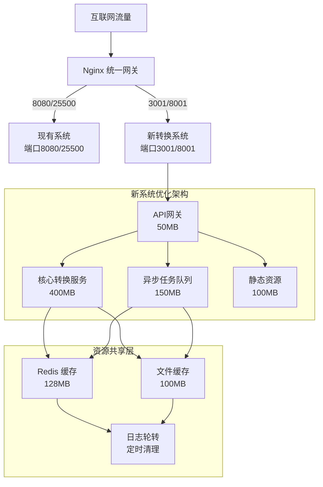

# 弱性能VPS优化架构设计方案

## 📋 环境分析与资源评估

### 当前环境概况
- **VPS性能**: 1-2核CPU，1-2GB内存，20-40GB存储
- **现有系统**: 端口8080/25500已占用，运行稳定
- **新系统端口**: 3001/8001
- **负载均衡**: Nginx路径分发

### 资源分配策略
```
总资源池 (假设2GB内存，2核CPU)
├── 系统预留: 512MB内存，0.5核CPU
├── 现有系统: 512MB内存，0.5核CPU  
├── 新系统主服务: 700MB内存，0.8核CPU
└── 共享服务: 256MB内存，0.2核CPU
```

## 🏗️ 系统架构设计

### 整体架构图


### 核心组件资源占用预估

| 组件 | 内存占用 | CPU占用 | 存储占用 | 说明 |
|------|----------|---------|----------|------|
| Nginx主网关 | 64MB | 5% | 50MB | 统一代理，连接池复用 |
| API网关 | 50MB | 10% | 30MB | 轻量级FastAPI实例 |
| 核心转换服务 | 400MB | 60% | 200MB | 主要业务逻辑 |
| 异步任务队列 | 150MB | 20% | 100MB | Celery+Redis |
| Redis缓存 | 128MB | 3% | 50MB | 共享缓存，内存优化 |
| 静态资源服务 | 100MB | 2% | 500MB | 压缩后的前端资源 |
| **总计** | **892MB** | **100%** | **930MB** | 预留108MB内存缓冲 |

## ⚡ 性能优化技术方案

### 1. 内存优化架构

#### 内存池管理
```python
# backend/app/core/memory_pool.py
import gc
import psutil
from typing import Dict, Any
from functools import lru_cache

class MemoryOptimizer:
    """内存优化器"""
    
    def __init__(self, max_memory_mb: int = 400):
        self.max_memory_mb = max_memory_mb
        self.cache_size_limit = 1000
        
    @lru_cache(maxsize=500)  # 限制缓存大小
    def get_cached_config(self, config_hash: str) -> Dict[str, Any]:
        """缓存配置文件，避免重复解析"""
        pass
    
    def memory_guard(self):
        """内存守护，超限时自动清理"""
        process = psutil.Process()
        memory_mb = process.memory_info().rss / 1024 / 1024
        
        if memory_mb > self.max_memory_mb * 0.9:
            # 清理缓存
            self.get_cached_config.cache_clear()
            # 强制垃圾回收
            gc.collect()
            
    def optimize_data_structures(self, data: list) -> list:
        """优化数据结构，使用生成器减少内存"""
        if len(data) > 1000:
            return self._chunk_generator(data, chunk_size=100)
        return data
    
    def _chunk_generator(self, data: list, chunk_size: int):
        """分块生成器，流式处理大数据"""
        for i in range(0, len(data), chunk_size):
            yield data[i:i + chunk_size]
```

#### 智能缓存策略
```yaml
# backend/config/cache.yaml
cache:
  redis:
    host: "127.0.0.1"
    port: 6379
    db: 0
    max_memory: "128mb"
    maxmemory_policy: "allkeys-lru"
    
  application:
    subscription_cache:
      ttl: 3600  # 1小时
      max_size: 500
      
    config_cache:
      ttl: 7200  # 2小时
      max_size: 100
      
    node_cache:
      ttl: 1800  # 30分钟
      max_size: 1000
```

### 2. CPU效率优化

#### 异步处理架构
```python
# backend/app/core/async_processor.py
import asyncio
import aiohttp
from concurrent.futures import ThreadPoolExecutor
from typing import List, Dict, Any

class AsyncProcessor:
    """异步处理器"""
    
    def __init__(self, max_workers: int = 4):
        self.session_pool = aiohttp.ClientSession(
            connector=aiohttp.TCPConnector(
                limit=100,  # 连接池大小
                limit_per_host=20,
                keepalive_timeout=30
            )
        )
        self.thread_pool = ThreadPoolExecutor(max_workers=max_workers)
        
    async def process_subscriptions(self, urls: List[str]) -> Dict[str, Any]:
        """并发处理订阅链接"""
        semaphore = asyncio.Semaphore(5)  # 限制并发数
        
        async def fetch_with_limit(url: str):
            async with semaphore:
                return await self._fetch_subscription(url)
                
        tasks = [fetch_with_limit(url) for url in urls]
        results = await asyncio.gather(*tasks, return_exceptions=True)
        return self._merge_results(results)
    
    async def _fetch_subscription(self, url: str) -> Dict[str, Any]:
        """获取单个订阅"""
        try:
            timeout = aiohttp.ClientTimeout(total=15)
            async with self.session_pool.get(url, timeout=timeout) as response:
                if response.status == 200:
                    content = await response.text()
                    return {"url": url, "content": content, "status": "success"}
        except Exception as e:
            return {"url": url, "error": str(e), "status": "failed"}
```

#### 任务队列设计
```python
# backend/app/core/task_queue.py
from celery import Celery
from kombu import Queue
import redis

# Celery配置优化
celery_app = Celery('clash_converter')

celery_app.conf.update(
    # Redis作为消息代理
    broker_url='redis://localhost:6379/1',
    result_backend='redis://localhost:6379/2',
    
    # 性能优化配置
    worker_prefetch_multiplier=1,  # 每次只预取一个任务
    task_acks_late=True,          # 任务完成后确认
    worker_max_tasks_per_child=1000,  # 工作进程处理任务上限
    
    # 任务路由
    task_routes={
        'convert_subscription': {'queue': 'high_priority'},
        'cleanup_cache': {'queue': 'low_priority'},
    },
    
    # 队列定义
    task_queues=(
        Queue('high_priority', routing_key='high_priority'),
        Queue('low_priority', routing_key='low_priority'),
    ),
)

@celery_app.task(bind=True)
def convert_subscription(self, subscription_data: dict):
    """异步转换任务"""
    try:
        # 更新任务状态
        self.update_state(state='PROCESSING', meta={'progress': 0})
        
        # 执行转换逻辑
        result = perform_conversion(subscription_data)
        
        # 完成任务
        self.update_state(state='SUCCESS', meta={'progress': 100})
        return result
        
    except Exception as exc:
        # 任务失败处理
        self.update_state(state='FAILURE', meta={'error': str(exc)})
        raise
```

### 3. 存储空间优化

#### 压缩存储策略
```python
# backend/app/utils/storage_optimizer.py
import gzip
import json
import os
import hashlib
from pathlib import Path
from typing import Any, Dict

class StorageOptimizer:
    """存储优化器"""
    
    def __init__(self, cache_dir: str = "/tmp/clash_cache"):
        self.cache_dir = Path(cache_dir)
        self.cache_dir.mkdir(exist_ok=True)
        self.max_cache_size_mb = 100
        
    def save_compressed_config(self, config_data: Dict[str, Any], config_id: str) -> str:
        """压缩保存配置文件"""
        # 生成文件路径
        config_hash = hashlib.md5(config_id.encode()).hexdigest()
        file_path = self.cache_dir / f"{config_hash}.json.gz"
        
        # 压缩存储
        with gzip.open(file_path, 'wt', encoding='utf-8') as f:
            json.dump(config_data, f, separators=(',', ':'))  # 紧凑格式
            
        # 检查缓存大小
        self._cleanup_old_cache()
        return str(file_path)
    
    def load_compressed_config(self, config_id: str) -> Dict[str, Any]:
        """加载压缩配置"""
        config_hash = hashlib.md5(config_id.encode()).hexdigest()
        file_path = self.cache_dir / f"{config_hash}.json.gz"
        
        if file_path.exists():
            with gzip.open(file_path, 'rt', encoding='utf-8') as f:
                return json.load(f)
        return {}
    
    def _cleanup_old_cache(self):
        """清理旧缓存文件"""
        total_size = sum(f.stat().st_size for f in self.cache_dir.glob('*.gz'))
        max_size_bytes = self.max_cache_size_mb * 1024 * 1024
        
        if total_size > max_size_bytes:
            # 按修改时间排序，删除最旧的文件
            files = sorted(self.cache_dir.glob('*.gz'), key=lambda f: f.stat().st_mtime)
            while total_size > max_size_bytes * 0.8:  # 清理到80%
                if files:
                    old_file = files.pop(0)
                    total_size -= old_file.stat().st_size
                    old_file.unlink()
                else:
                    break
```

#### 日志轮转配置
```yaml
# deploy/logging.yaml
logging:
  version: 1
  disable_existing_loggers: false
  
  formatters:
    compact:
      format: '%(asctime)s|%(levelname)s|%(name)s|%(message)s'
      datefmt: '%H:%M:%S'
  
  handlers:
    rotating_file:
      class: logging.handlers.RotatingFileHandler
      filename: 'logs/app.log'
      maxBytes: 10485760  # 10MB
      backupCount: 3
      formatter: compact
      
    error_file:
      class: logging.handlers.RotatingFileHandler
      filename: 'logs/error.log'
      maxBytes: 5242880   # 5MB
      backupCount: 2
      level: ERROR
      formatter: compact
  
  root:
    level: INFO
    handlers: [rotating_file, error_file]
```

### 4. 网络资源优化

#### 连接池复用配置
```nginx
# deploy/nginx_optimized.conf
worker_processes 1;  # 单核优化
worker_rlimit_nofile 1024;

events {
    worker_connections 512;
    use epoll;
    multi_accept on;
}

http {
    # 连接复用
    upstream backend_new {
        server 127.0.0.1:3001 max_fails=3 fail_timeout=30s;
        keepalive 8;  # 保持8个长连接
    }
    
    upstream backend_old {
        server 127.0.0.1:8080 max_fails=3 fail_timeout=30s;
        server 127.0.0.1:25500 backup;  # 备用服务器
        keepalive 4;
    }
    
    # 性能优化
    sendfile on;
    tcp_nopush on;
    tcp_nodelay on;
    keepalive_timeout 30;
    keepalive_requests 100;
    
    # 压缩设置
    gzip on;
    gzip_vary on;
    gzip_min_length 1024;
    gzip_comp_level 6;
    gzip_types text/css application/javascript application/json;
    
    # 缓存设置
    proxy_cache_path /tmp/nginx_cache levels=1:2 keys_zone=api_cache:16m 
                     max_size=100m inactive=60m;
    
    # 限流设置
    limit_req_zone $binary_remote_addr zone=api:1m rate=30r/m;
    limit_req_zone $binary_remote_addr zone=convert:1m rate=10r/m;
    
    server {
        listen 80;
        server_name _;
        
        # 现有系统路由
        location ~ ^/(old|legacy)/ {
            proxy_pass http://backend_old;
            proxy_http_version 1.1;
            proxy_set_header Connection "";
            
            # 缓存设置
            proxy_cache api_cache;
            proxy_cache_valid 200 5m;
            add_header X-Cache-Status $upstream_cache_status;
        }
        
        # 新系统路由
        location ~ ^/(api|convert|new)/ {
            limit_req zone=convert burst=5 nodelay;
            
            proxy_pass http://backend_new;
            proxy_http_version 1.1;
            proxy_set_header Connection "";
            proxy_set_header Host $host;
            
            # 超时设置
            proxy_connect_timeout 10s;
            proxy_send_timeout 30s;
            proxy_read_timeout 30s;
        }
        
        # 静态资源
        location /static/ {
            root /var/www;
            expires 1d;
            add_header Cache-Control "public, immutable";
            gzip_static on;
        }
    }
}
```

#### 请求合并优化
```python
# backend/app/utils/request_optimizer.py
import asyncio
import time
from collections import defaultdict
from typing import List, Dict, Any

class RequestBatcher:
    """请求批处理器"""
    
    def __init__(self, batch_size: int = 10, batch_timeout: float = 2.0):
        self.batch_size = batch_size
        self.batch_timeout = batch_timeout
        self.pending_requests = defaultdict(list)
        
    async def add_request(self, request_type: str, request_data: Dict[str, Any]) -> Any:
        """添加请求到批处理队列"""
        request_id = id(request_data)
        future = asyncio.Future()
        
        self.pending_requests[request_type].append({
            'id': request_id,
            'data': request_data,
            'future': future,
            'timestamp': time.time()
        })
        
        # 检查是否需要触发批处理
        if len(self.pending_requests[request_type]) >= self.batch_size:
            asyncio.create_task(self._process_batch(request_type))
        else:
            # 设置超时触发
            asyncio.create_task(self._timeout_trigger(request_type))
            
        return await future
    
    async def _process_batch(self, request_type: str):
        """处理批次请求"""
        if not self.pending_requests[request_type]:
            return
            
        batch = self.pending_requests[request_type]
        self.pending_requests[request_type] = []
        
        try:
            # 批量处理逻辑
            results = await self._batch_convert([req['data'] for req in batch])
            
            # 分发结果
            for req, result in zip(batch, results):
                req['future'].set_result(result)
                
        except Exception as e:
            # 错误处理
            for req in batch:
                req['future'].set_exception(e)
    
    async def _timeout_trigger(self, request_type: str):
        """超时触发批处理"""
        await asyncio.sleep(self.batch_timeout)
        if self.pending_requests[request_type]:
            await self._process_batch(request_type)
```

## 🔧 双系统共存设计

### 资源隔离机制

#### 内存隔离
```bash
# 使用cgroups限制内存使用
sudo cgcreate -g memory:/clash_new
sudo cgcreate -g memory:/clash_old
echo 700M | sudo tee /sys/fs/cgroup/memory/clash_new/memory.limit_in_bytes
echo 500M | sudo tee /sys/fs/cgroup/memory/clash_old/memory.limit_in_bytes
```

#### 端口冲突避免
```python
# backend/app/core/port_manager.py
import socket
from typing import List

class PortManager:
    """端口管理器"""
    
    RESERVED_PORTS = [8080, 25500]  # 现有系统占用端口
    AVAILABLE_PORTS = [3001, 8001]  # 新系统可用端口
    
    @staticmethod
    def check_port_available(port: int) -> bool:
        """检查端口是否可用"""
        try:
            with socket.socket(socket.AF_INET, socket.SOCK_STREAM) as s:
                s.bind(('localhost', port))
                return True
        except OSError:
            return False
    
    @classmethod
    def get_available_port(cls, preferred_ports: List[int]) -> int:
        """获取可用端口"""
        for port in preferred_ports:
            if port not in cls.RESERVED_PORTS and cls.check_port_available(port):
                return port
        
        # 动态分配端口
        for port in range(3000, 4000):
            if port not in cls.RESERVED_PORTS and cls.check_port_available(port):
                return port
                
        raise RuntimeError("无可用端口")
```

#### 进程间通信
```python
# backend/app/core/ipc.py
import redis
import json
from typing import Dict, Any

class IPCManager:
    """进程间通信管理器"""
    
    def __init__(self):
        self.redis_client = redis.StrictRedis(
            host='localhost', 
            port=6379, 
            db=3,  # 专用于IPC
            decode_responses=True
        )
        
    def publish_system_event(self, event_type: str, data: Dict[str, Any]):
        """发布系统事件"""
        message = {
            'type': event_type,
            'timestamp': time.time(),
            'data': data
        }
        self.redis_client.publish('system_events', json.dumps(message))
    
    def subscribe_system_events(self, callback):
        """订阅系统事件"""
        pubsub = self.redis_client.pubsub()
        pubsub.subscribe('system_events')
        
        for message in pubsub.listen():
            if message['type'] == 'message':
                event_data = json.loads(message['data'])
                callback(event_data)
```

### 故障隔离机制
```python
# backend/app/core/circuit_breaker.py
import time
from enum import Enum
from typing import Callable, Any

class CircuitState(Enum):
    CLOSED = "closed"      # 正常状态
    OPEN = "open"          # 熔断状态
    HALF_OPEN = "half_open" # 半开状态

class CircuitBreaker:
    """熔断器，防止故障扩散"""
    
    def __init__(self, failure_threshold: int = 5, timeout: int = 60):
        self.failure_threshold = failure_threshold
        self.timeout = timeout
        self.failure_count = 0
        self.last_failure_time = None
        self.state = CircuitState.CLOSED
    
    def call(self, func: Callable, *args, **kwargs) -> Any:
        """执行函数调用，带熔断保护"""
        if self.state == CircuitState.OPEN:
            if time.time() - self.last_failure_time > self.timeout:
                self.state = CircuitState.HALF_OPEN
            else:
                raise Exception("服务熔断中，请稍后重试")
        
        try:
            result = func(*args, **kwargs)
            self._on_success()
            return result
            
        except Exception as e:
            self._on_failure()
            raise e
    
    def _on_success(self):
        """成功回调"""
        self.failure_count = 0
        self.state = CircuitState.CLOSED
    
    def _on_failure(self):
        """失败回调"""
        self.failure_count += 1
        self.last_failure_time = time.time()
        
        if self.failure_count >= self.failure_threshold:
            self.state = CircuitState.OPEN
```

## 📊 监控和告警机制

### 系统监控配置
```python
# backend/app/monitoring/monitor.py
import psutil
import time
import logging
from typing import Dict, Any

class SystemMonitor:
    """系统监控器"""
    
    def __init__(self):
        self.logger = logging.getLogger(__name__)
        self.metrics = {}
        
    def collect_metrics(self) -> Dict[str, Any]:
        """收集系统指标"""
        # CPU使用率
        cpu_percent = psutil.cpu_percent(interval=1)
        
        # 内存使用率
        memory = psutil.virtual_memory()
        memory_percent = memory.percent
        memory_available_mb = memory.available / 1024 / 1024
        
        # 磁盘使用率
        disk = psutil.disk_usage('/')
        disk_percent = disk.percent
        disk_free_gb = disk.free / 1024 / 1024 / 1024
        
        # 网络IO
        net_io = psutil.net_io_counters()
        
        metrics = {
            'timestamp': time.time(),
            'cpu_percent': cpu_percent,
            'memory_percent': memory_percent,
            'memory_available_mb': memory_available_mb,
            'disk_percent': disk_percent,
            'disk_free_gb': disk_free_gb,
            'network_bytes_sent': net_io.bytes_sent,
            'network_bytes_recv': net_io.bytes_recv,
        }
        
        self.metrics = metrics
        return metrics
    
    def check_alerts(self, metrics: Dict[str, Any]):
        """检查告警条件"""
        alerts = []
        
        # CPU告警
        if metrics['cpu_percent'] > 80:
            alerts.append(f"CPU使用率过高: {metrics['cpu_percent']:.1f}%")
        
        # 内存告警
        if metrics['memory_percent'] > 85:
            alerts.append(f"内存使用率过高: {metrics['memory_percent']:.1f}%")
        
        # 磁盘告警
        if metrics['disk_percent'] > 90:
            alerts.append(f"磁盘使用率过高: {metrics['disk_percent']:.1f}%")
        
        # 可用内存告警
        if metrics['memory_available_mb'] < 100:
            alerts.append(f"可用内存不足: {metrics['memory_available_mb']:.0f}MB")
        
        return alerts
    
    async def monitor_loop(self):
        """监控循环"""
        while True:
            try:
                metrics = self.collect_metrics()
                alerts = self.check_alerts(metrics)
                
                if alerts:
                    for alert in alerts:
                        self.logger.warning(f"🚨 系统告警: {alert}")
                        await self._send_alert(alert)
                
                # 记录指标
                self.logger.info(f"📊 系统指标: CPU={metrics['cpu_percent']:.1f}% "
                               f"内存={metrics['memory_percent']:.1f}% "
                               f"磁盘={metrics['disk_percent']:.1f}%")
                
                await asyncio.sleep(30)  # 30秒监控一次
                
            except Exception as e:
                self.logger.error(f"监控异常: {e}")
                await asyncio.sleep(60)
    
    async def _send_alert(self, alert_message: str):
        """发送告警"""
        # 这里可以集成邮件、短信、钉钉等告警渠道
        pass
```

### 性能监控指标
```python
# backend/app/monitoring/performance.py
import time
import functools
from collections import defaultdict, deque
from typing import Dict, List

class PerformanceMonitor:
    """性能监控器"""
    
    def __init__(self):
        self.request_times = defaultdict(lambda: deque(maxlen=1000))
        self.error_counts = defaultdict(int)
        self.request_counts = defaultdict(int)
        
    def track_request(self, endpoint: str):
        """请求追踪装饰器"""
        def decorator(func):
            @functools.wraps(func)
            async def wrapper(*args, **kwargs):
                start_time = time.time()
                try:
                    result = await func(*args, **kwargs)
                    self.request_counts[endpoint] += 1
                    return result
                except Exception as e:
                    self.error_counts[endpoint] += 1
                    raise
                finally:
                    duration = time.time() - start_time
                    self.request_times[endpoint].append(duration)
            return wrapper
        return decorator
    
    def get_performance_stats(self) -> Dict[str, Dict[str, float]]:
        """获取性能统计"""
        stats = {}
        
        for endpoint, times in self.request_times.items():
            if times:
                times_list = list(times)
                stats[endpoint] = {
                    'avg_response_time': sum(times_list) / len(times_list),
                    'max_response_time': max(times_list),
                    'min_response_time': min(times_list),
                    'p95_response_time': sorted(times_list)[int(len(times_list) * 0.95)],
                    'request_count': self.request_counts[endpoint],
                    'error_count': self.error_counts[endpoint],
                    'error_rate': self.error_counts[endpoint] / self.request_counts[endpoint] if self.request_counts[endpoint] > 0 else 0
                }
        
        return stats
```

## 📈 扩容和降级策略

### 自动扩容策略
```python
# backend/app/core/auto_scaling.py
import asyncio
import psutil
from typing import Dict, Any

class AutoScaler:
    """自动扩缩容管理器"""
    
    def __init__(self):
        self.current_workers = 2
        self.min_workers = 1
        self.max_workers = 4
        self.cpu_threshold_up = 70.0
        self.cpu_threshold_down = 30.0
        self.memory_threshold = 80.0
        
    async def scale_monitor(self):
        """扩缩容监控"""
        while True:
            try:
                metrics = await self._get_metrics()
                await self._evaluate_scaling(metrics)
                await asyncio.sleep(60)  # 1分钟检查一次
            except Exception as e:
                print(f"扩缩容监控异常: {e}")
                await asyncio.sleep(60)
    
    async def _get_metrics(self) -> Dict[str, float]:
        """获取系统指标"""
        cpu_percent = psutil.cpu_percent(interval=5)
        memory_percent = psutil.virtual_memory().percent
        
        return {
            'cpu_percent': cpu_percent,
            'memory_percent': memory_percent,
        }
    
    async def _evaluate_scaling(self, metrics: Dict[str, float]):
        """评估扩缩容"""
        cpu_percent = metrics['cpu_percent']
        memory_percent = metrics['memory_percent']
        
        # 内存不足时强制限制
        if memory_percent > self.memory_threshold:
            if self.current_workers > self.min_workers:
                await self._scale_down()
            return
        
        # CPU使用率高时扩容
        if cpu_percent > self.cpu_threshold_up and self.current_workers < self.max_workers:
            await self._scale_up()
        
        # CPU使用率低时缩容
        elif cpu_percent < self.cpu_threshold_down and self.current_workers > self.min_workers:
            await self._scale_down()
    
    async def _scale_up(self):
        """扩容"""
        self.current_workers += 1
        print(f"🚀 扩容: 工作进程数增加到 {self.current_workers}")
        # 这里添加实际的扩容逻辑，如启动新的worker进程
        
    async def _scale_down(self):
        """缩容"""
        self.current_workers -= 1
        print(f"📉 缩容: 工作进程数减少到 {self.current_workers}")
        # 这里添加实际的缩容逻辑，如停止worker进程
```

### 服务降级机制
```python
# backend/app/core/degradation.py
import time
from enum import Enum
from typing import Dict, Any, Optional

class ServiceLevel(Enum):
    FULL = "full"           # 完整服务
    LIMITED = "limited"     # 限制服务
    ESSENTIAL = "essential" # 基础服务
    EMERGENCY = "emergency" # 应急服务

class DegradationManager:
    """服务降级管理器"""
    
    def __init__(self):
        self.current_level = ServiceLevel.FULL
        self.degradation_rules = {
            ServiceLevel.FULL: {
                'max_concurrent_requests': 50,
                'enable_cache': True,
                'enable_async_processing': True,
                'max_subscription_size_mb': 10,
            },
            ServiceLevel.LIMITED: {
                'max_concurrent_requests': 20,
                'enable_cache': True,
                'enable_async_processing': False,
                'max_subscription_size_mb': 5,
            },
            ServiceLevel.ESSENTIAL: {
                'max_concurrent_requests': 10,
                'enable_cache': False,
                'enable_async_processing': False,
                'max_subscription_size_mb': 2,
            },
            ServiceLevel.EMERGENCY: {
                'max_concurrent_requests': 5,
                'enable_cache': False,
                'enable_async_processing': False,
                'max_subscription_size_mb': 1,
            }
        }
    
    def degrade_service(self, system_metrics: Dict[str, float]) -> ServiceLevel:
        """根据系统指标降级服务"""
        cpu_percent = system_metrics.get('cpu_percent', 0)
        memory_percent = system_metrics.get('memory_percent', 0)
        memory_available_mb = system_metrics.get('memory_available_mb', 1000)
        
        # 应急降级条件
        if memory_available_mb < 50 or memory_percent > 95:
            new_level = ServiceLevel.EMERGENCY
        # 基础服务条件
        elif memory_available_mb < 100 or memory_percent > 90 or cpu_percent > 90:
            new_level = ServiceLevel.ESSENTIAL
        # 限制服务条件
        elif memory_available_mb < 200 or memory_percent > 80 or cpu_percent > 75:
            new_level = ServiceLevel.LIMITED
        # 完整服务条件
        else:
            new_level = ServiceLevel.FULL
        
        if new_level != self.current_level:
            print(f"🔽 服务降级: {self.current_level.value} -> {new_level.value}")
            self.current_level = new_level
            
        return self.current_level
    
    def get_service_config(self) -> Dict[str, Any]:
        """获取当前服务级别配置"""
        return self.degradation_rules[self.current_level]
    
    def is_request_allowed(self, current_requests: int) -> bool:
        """检查请求是否允许"""
        config = self.get_service_config()
        return current_requests < config['max_concurrent_requests']
```

## 🚀 部署脚本

### 优化部署脚本
```bash
#!/bin/bash
# deploy/deploy_optimized.sh

set -e

# 颜色定义
RED='\033[0;31m'
GREEN='\033[0;32m'
YELLOW='\033[1;33m'
NC='\033[0m'

echo -e "${GREEN}🚀 开始部署弱性能VPS优化版本${NC}"

# 系统检查
check_system() {
    echo -e "${YELLOW}📋 检查系统资源...${NC}"
    
    # 检查内存
    total_mem=$(free -m | awk 'NR==2{printf "%.0f", $2}')
    available_mem=$(free -m | awk 'NR==2{printf "%.0f", $7}')
    
    if [ $total_mem -lt 1024 ]; then
        echo -e "${RED}❌ 内存不足1GB，建议升级VPS配置${NC}"
        exit 1
    fi
    
    if [ $available_mem -lt 500 ]; then
        echo -e "${RED}❌ 可用内存不足500MB，请清理系统内存${NC}"
        exit 1
    fi
    
    echo -e "${GREEN}✅ 内存检查通过: 总内存${total_mem}MB, 可用内存${available_mem}MB${NC}"
    
    # 检查磁盘空间
    available_disk=$(df / | awk 'NR==2 {print $4}')
    if [ $available_disk -lt 2097152 ]; then  # 2GB in KB
        echo -e "${RED}❌ 磁盘空间不足2GB${NC}"
        exit 1
    fi
    
    echo -e "${GREEN}✅ 磁盘空间充足${NC}"
}

# 优化系统配置
optimize_system() {
    echo -e "${YELLOW}⚙️ 优化系统配置...${NC}"
    
    # 启用交换空间
    if [ ! -f /swapfile ]; then
        sudo fallocate -l 512M /swapfile
        sudo chmod 600 /swapfile
        sudo mkswap /swapfile
        sudo swapon /swapfile
        echo '/swapfile none swap sw 0 0' | sudo tee -a /etc/fstab
        echo -e "${GREEN}✅ 已创建512MB交换空间${NC}"
    fi
    
    # 优化内核参数
    sudo tee -a /etc/sysctl.conf > /dev/null << EOF
# 网络优化
net.core.somaxconn = 1024
net.ipv4.tcp_max_syn_backlog = 1024
net.ipv4.tcp_fin_timeout = 30
net.ipv4.tcp_keepalive_time = 1200
net.ipv4.tcp_max_tw_buckets = 5000

# 内存优化
vm.swappiness = 10
vm.dirty_ratio = 15
vm.dirty_background_ratio = 5
EOF
    
    sudo sysctl -p
    echo -e "${GREEN}✅ 系统参数优化完成${NC}"
}

# 创建优化配置
create_optimized_config() {
    echo -e "${YELLOW}📝 创建优化配置文件...${NC}"
    
    # 创建.env文件
    cat > .env << EOF
# 弱性能VPS优化配置
BACKEND_PORT=3001
FRONTEND_PORT=8001
NGINX_PORT=80

# 资源限制配置
MAX_WORKERS=2
MAX_MEMORY_MB=400
CACHE_SIZE_MB=100
LOG_LEVEL=WARNING

# Redis配置
REDIS_MAXMEMORY=128mb
REDIS_MAXMEMORY_POLICY=allkeys-lru

# 性能优化配置
ENABLE_COMPRESSION=true
ENABLE_CACHING=true
BATCH_SIZE=5
REQUEST_TIMEOUT=15
EOF

    # 创建Docker Compose优化配置
    cat > docker-compose.optimized.yml << 'EOF'
version: '3.8'

services:
  redis:
    image: redis:alpine
    container_name: clash-redis
    restart: unless-stopped
    command: redis-server --maxmemory 128mb --maxmemory-policy allkeys-lru
    ports:
      - "127.0.0.1:6379:6379"
    volumes:
      - redis_data:/data
    networks:
      - clash-network

  backend:
    build:
      context: ./backend
      dockerfile: Dockerfile.optimized
    container_name: clash-backend-optimized
    restart: unless-stopped
    ports:
      - "${BACKEND_PORT:-3001}:3001"
    environment:
      - PYTHONPATH=/app
      - WORKERS=2
      - MAX_MEMORY_MB=400
    volumes:
      - ./backend/config.yaml:/app/config.yaml:ro
      - ./backend/logs:/app/logs
      - backend_cache:/app/cache
    depends_on:
      - redis
    networks:
      - clash-network
    deploy:
      resources:
        limits:
          memory: 450M
        reservations:
          memory: 300M

  frontend:
    build:
      context: ./frontend
      dockerfile: Dockerfile.optimized
    container_name: clash-frontend-optimized
    restart: unless-stopped
    ports:
      - "${FRONTEND_PORT:-8001}:80"
    networks:
      - clash-network
    deploy:
      resources:
        limits:
          memory: 100M
        reservations:
          memory: 50M

  nginx:
    image: nginx:alpine
    container_name: clash-nginx-optimized
    restart: unless-stopped
    ports:
      - "${NGINX_PORT:-80}:80"
    volumes:
      - ./deploy/nginx_optimized.conf:/etc/nginx/nginx.conf:ro
      - nginx_cache:/var/cache/nginx
    depends_on:
      - backend
      - frontend
    networks:
      - clash-network
    deploy:
      resources:
        limits:
          memory: 64M
        reservations:
          memory: 32M

networks:
  clash-network:
    driver: bridge

volumes:
  redis_data:
  backend_cache:
  nginx_cache:
EOF

    echo -e "${GREEN}✅ 优化配置文件创建完成${NC}"
}

# 构建并启动服务
deploy_services() {
    echo -e "${YELLOW}🏗️ 构建并启动优化服务...${NC}"
    
    # 停止现有的docker-compose服务（如果存在）
    docker-compose -f docker-compose.optimized.yml down 2>/dev/null || true
    
    # 构建并启动
    docker-compose -f docker-compose.optimized.yml build
    docker-compose -f docker-compose.optimized.yml up -d
    
    echo -e "${GREEN}✅ 服务启动完成${NC}"
}

# 验证部署
verify_deployment() {
    echo -e "${YELLOW}🔍 验证部署状态...${NC}"
    
    sleep 10  # 等待服务启动
    
    # 检查Redis
    if docker-compose -f docker-compose.optimized.yml ps redis | grep -q "Up"; then
        echo -e "${GREEN}✅ Redis服务正常${NC}"
    else
        echo -e "${RED}❌ Redis服务异常${NC}"
    fi
    
    # 检查后端
    if curl -f http://localhost:${BACKEND_PORT:-3001}/health > /dev/null 2>&1; then
        echo -e "${GREEN}✅ 后端服务正常${NC}"
    else
        echo -e "${RED}❌ 后端服务异常${NC}"
    fi
    
    # 检查前端
    if curl -f http://localhost:${FRONTEND_PORT:-8001}/ > /dev/null 2>&1; then
        echo -e "${GREEN}✅ 前端服务正常${NC}"
    else
        echo -e "${RED}❌ 前端服务异常${NC}"
    fi
    
    # 显示服务状态
    echo -e "${YELLOW}📊 服务状态:${NC}"
    docker-compose -f docker-compose.optimized.yml ps
    
    # 显示资源使用情况
    echo -e "${YELLOW}💾 内存使用情况:${NC}"
    docker stats --no-stream --format "table {{.Name}}\t{{.CPUPerc}}\t{{.MemUsage}}"
}

# 主函数
main() {
    check_system
    optimize_system
    create_optimized_config
    deploy_services
    verify_deployment
    
    echo -e "${GREEN}🎉 弱性能VPS优化部署完成!${NC}"
    echo -e "${YELLOW}📝 访问地址:${NC}"
    echo -e "  前端: http://localhost:${FRONTEND_PORT:-8001}"
    echo -e "  后端API: http://localhost:${BACKEND_PORT:-3001}/docs"
    echo -e "  健康检查: http://localhost:${BACKEND_PORT:-3001}/health"
    echo -e "  监控指标: http://localhost:${BACKEND_PORT:-3001}/metrics"
}

# 执行主函数
main "$@"
```

## 📋 总结

这个弱性能VPS优化架构设计方案包含以下核心特性：

### 🎯 核心优化策略
1. **内存优化**: 智能缓存、内存池管理、垃圾回收优化
2. **CPU效率**: 异步处理、任务队列、协程优化  
3. **存储优化**: 压缩存储、缓存管理、日志轮转
4. **网络优化**: 连接池复用、请求合并、带宽控制

### 🛡️ 双系统共存
1. **资源隔离**: 内存、CPU、端口隔离机制
2. **进程通信**: Redis IPC、事件发布订阅
3. **故障隔离**: 熔断器、服务降级、故障恢复

### 📊 监控告警
1. **实时监控**: CPU、内存、磁盘、网络指标
2. **性能追踪**: 请求时间、错误率、吞吐量
3. **自动告警**: 阈值检测、告警通知

### 📈 弹性扩展
1. **自动扩缩容**: 基于资源使用率的动态调整
2. **服务降级**: 四级降级机制，保证核心服务
3. **故障恢复**: 健康检查、自动重启、状态恢复

通过这个架构设计，新的订阅转换系统能够在资源受限的VPS环境下高效运行，同时不影响现有系统的稳定性。系统具备良好的可维护性、可扩展性和容错能力。